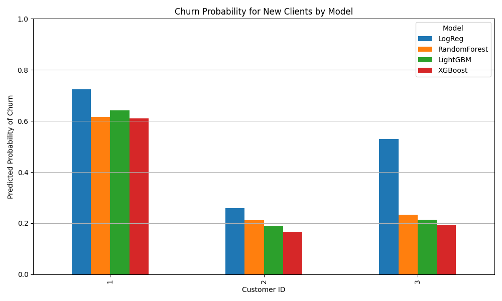

# Customer Churn Prediction Pipeline

## Overview
This educational project implements a **machine learning pipeline for customer churn prediction**.  
The pipeline automates the entire process, from **data preprocessing** to **model training, evaluation, and visualization**.  

The models’ hyperparameters are selected based on the results of the `notebooks/03_Modelling_Hyperparam.ipynb`.  

The goal is to identify customers at risk of churn so that targeted retention strategies can be implemented.

---

## Dataset
The base dataset comes from [Kaggle](https://www.kaggle.com/blastchar/telco-customer-churn).  
It contains information about **7,043 customers** of a telecommunications company, including:
- **Demographic features** (gender, senior citizen, partners, dependents)  
- **Services subscribed** (phone, internet, streaming, etc.)  
- **Account information** (tenure, contract type, billing method, charges)  
- **Churn label** (whether the customer has left within the last month)  

The target variable is:
- `Churn` = `Yes` if the customer left, `No` otherwise.

### Additional Variables
The pipeline is designed to **incorporate extra features** from multiple sources to improve predictive performance, including:
- Marketing campaigns (email clicks, promo responses)  
- Customer support interactions (tickets, complaints)  
- Behavioral metrics (usage patterns, service engagement)  

These additional variables can be merged with the base dataset in the preprocessing stage, making the pipeline flexible for multi-source data integration.

### New Client Predictions
For demonstration, the pipeline can predict churn probabilities for **new clients**.  
A CSV file with new clients (`data/raw/new_clients.csv`) can be created and contains all necessary features (base + additional variables).  
The script `src/predict_new_client.py` applies the trained models to these clients, using the saved **encoders and scaler**, and generates a **bar chart of predicted churn probabilities** for each model.  

The resulting figure is saved to:  


---

## Models Evaluated
The following models were trained with optimized hyperparameters:
- Logistic Regression (LOGREG)  
- Random Forest (RF)  
- LightGBM (LGB)  
- XGBoost (XGB)  

All models achieved comparable performance with an **accuracy around 81%~82%** and **AUC ~0.85–0.86**. Logistic Regression slightly outperformed others in terms of F1-score.

---

## Results

### ROC Curve
The aggregated ROC curve for all models:  


### Confusion Matrices
The confusion matrices for each model:  


---

## How to Run

### 1. Clone the repository
```bash
git clone https://github.com/Ant-08/customer-churn-ml.git
cd customer-churn-ml
```
### 2. Create and activate a virtual environment
```bash
python -m venv venv
# On Linux/Mac
source venv/bin/activate
# On Windows (PowerShell)
venv\Scripts\activate
```
### 3. Install the dependencies
```bash
pip install -r requirements.txt
```
### 4. Generate processed datasets and features
```bash
python src/generate_marketing.py
python src/generate_support.py
python src/generate_transactions.py
```
### 5. Run the full pipeline
```bash
python src/run_pipeline.py
```
### 6. Predict churn for new clients (demo)
```bash
python src/generate_newclient.py
python src/predict_new_client.py
```